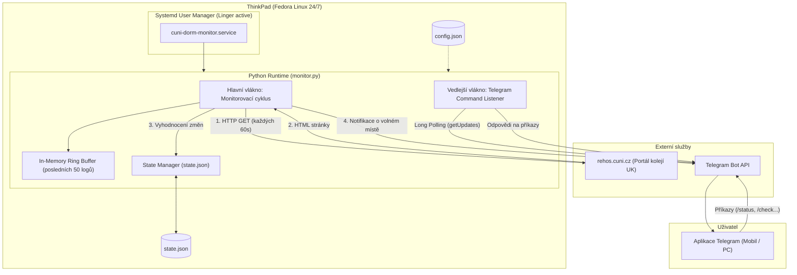

# Průvodce projektem: CUNI Dormitory Capacity Monitor od A do Z

Tento dokument detailně vysvětluje celou architekturu, princip fungování a všechny použité technologie monitorovacího systému pro koleje Univerzity Karlovy ([rehos.cuni.cz](https://rehos.cuni.cz)).

---

## 1. Cíl a zadání projektu

Při shánění ubytování na kolejích UK po termínu je nutné manuálně sledovat rezervační portál a čekat, až někdo ubytování zruší nebo se uvolní kapacita. Volná místa často zmizí během několika málo minut.

**Cíl:**
Vytvořit plně autonomní, lehký a spolehlivý systém běžící nepřetržitě (24/7) na starším notebooku ThinkPad s Linuxem (Fedora), který:
1. Periodicky kontroluje vybrané koleje UK (Hvězda, Budeč, Jednota, Na Větrníku, Švehlova, 17. listopadu).
2. Sleduje sloupce **Muži** a **Neurčeno**.
3. Při nalezení kapacity (> 0) ihned odešle podrobnou zprávu na Telegram.
4. Umožňuje plnohodnotné vzdálené ovládání přímo z Telegramu (příkazy `/status`, `/check`, `/logs`, `/stop`, `/start`, `/restart`).
5. Nezatěžuje domácí síť ani univerzitní server a je odolný vůči výpadkům sítě či restartům serveru.

---

## 2. Celková architektura systému



---

## 3. Použité technologie a systémové komponenty

### A. Operační systém a správa procesů (Linux Fedora & systemd)
- **systemd (User Services):**
  - Monitor neběží v provizorním `screen` nebo `nohup`, ale jako plnohodnotná systémová služba definovaná v `~/.config/systemd/user/cuni-dorm-monitor.service`.
  - **Automatický restart:** Direktivy `Restart=always` a `RestartSec=15` zajišťují, že pokud by proces z jakéhokoliv důvodu spadl (nebo při výpadku Wi-Fi), systemd jej do 15 sekund automaticky znovu nastartuje.
  - **Správa logů:** Veškerý standardní i chybový výstup (`stdout`, `stderr`) zachytává `journald`. Logy lze sledovat přes `journalctl --user -u cuni-dorm-monitor -f`.
- **`loginctl enable-linger admin`:**
  - V běžném Linuxu se uživatelské procesy ukončí ve chvíli, kdy se uživatel odhlásí ze session (např. zavře SSH terminál).
  - Volba **Linger** říká operačnímu systému: *„Tento uživatel má služby, které mají běžet na pozadí nepřetržitě 24/7 od startu systému až do vypnutí, i když není nikdo přihlášen.“*

---

### B. Jazyk a knihovny (Python 3)
Aplikace je napsána v moderním Pythonu s minimem externích závislostí:
- **`requests`:** Knihovna pro HTTP komunikaci. Využívá `requests.Session()`, která drží jedno TCP/TLS spojení otevřené (HTTP Keep-Alive), což šetří čas i síťové prostředky při stahování více stránek po sobě.
- **`threading`:** Dvě souběžná vlákna:
  1. *Monitorovací vlákno:* Pravidelně v intervalu kontroluje stránky kolejí.
  2. *Telegram listener vlákno:* Čeká na příchozí příkazy od uživatele a reaguje na ně bez zpoždění.
- **`collections.deque` (Ring Buffer):**
  - Speciální kruhová vyrovnávací paměť s pevnou délkou (50 záznamů).
  - Slouží pro příkaz `/logs`. Při příchodu nového logu se nejstarší automaticky zahodí. Tím se šetří paměť a příkaz `/logs` může okamžitě vrátit posledních 15 řádků bez čtení disku.
- **`signal`:** Obsluha signálů `SIGINT` (Ctrl+C) a `SIGTERM` (příkaz stop ze systemd). Umožňuje bezpečné ukončení běhu (graceful shutdown) a uložení stavu na disk.

---

### C. Web Scraping & Robustní parsování (rehos.cuni.cz)
Portál Rehos běží na starší technologii (Grails / JSP), která generuje specifický HTML kód:
1. **Chyby v syntaxi HTML na straně univerzity:**
   - Vývojáři Rehosu mají v šabloně překlep – buňky tabulky i hlavičky uzavírají otevíracím tagem namísto uzavíracího: `<th>Popis<th>`, `<td>198<td>`, `<td><b>0</b><td>`.
   - Běžné HTML parserové knihovny na tomto mohou selhat nebo vytvářet prázdné mezibuňky.
   - Náš parser v `monitor.py` využívá regulární výrazy a sanitizaci tagů, které tento specifický dialekt přesně zpracují bez ohledu na chybějící lomítka.
2. **Dynamické mapování sloupců (`col_map`):**
   - Skript nemá sloupce natvrdo zadrátované podle čísel 0, 1, 2...
   - Místo toho se při každém načtení podívá do `<thead>` tabulky, vyhledá klíčová slova (`popis`, `kč/cena`, `muž`, `žen`, `neurč`) a dynamicky si namapuje, na kterém indexu se která hodnota nachází. Kdyby správci webu prohodili sloupce *Muži* a *Ženy*, parser bude bez úprav fungovat dál.
3. **Pacing a ochrana před blokací (Anti-Ban):**
   - **Hlavička `User-Agent`:** Skript se hlásí jako standardní prohlížeč Chrome na Linuxu.
   - **Rozestup 1 sekunda:** Mezi stažením jednotlivých 6 kolejí je vložena 1sekundová pauza (`time.sleep(1.0)`). Požadavky tak nechodí jako nárazový burst, ale jako přirozené postupné načítání.
   - **Pouze čisté HTML:** Skript nestahuje obrázky, CSS styly ani měřicí skripty. Přenesený objem dat je pouze cca 130 kB za celou minutu (~2 kB/s), což je pro domácí Wi-Fi i univerzitní server zanedbatelné.

---

### D. Telegram Bot API & Ovládání
1. **Odesílání notifikací (`sendMessage`):**
   - Odesílá zprávy přes HTTPS POST na `https://api.telegram.org/bot<TOKEN>/sendMessage`.
   - Formátování: `parse_mode="HTML"`.
   - Zprávy obsahují přímé prolinky (`<a href="...">`), které umožní uživateli jedním kliknutím otevřít konkrétní kolej.
2. **Příjem příkazů (Long-Polling přes `getUpdates`):**
   - Vlákno se periodicky dotazuje Telegramu na nové zprávy s parametrem `timeout=5`. Spojení visí na serveru Telegramu a jakmile uživatel pošle zprávu, Telegram okamžitě odpoví.
   - **Autorizace:** Každá příchozí zpráva kontroluje ID odesílatele (`sender_id == telegram_chat_id`). Pokud by botovi napsal kdokoliv cizí, zpráva je ignorována.
3. **Příkazové menu (`setMyCommands`):**
   - Při startu bot automaticky zaregistruje seznam příkazů do Telegramu, takže uživatel má pod tlačítkem `/` přehledné menu s nápovědou.

---

### E. Správa stavu a ochrana před spamem (State Management)
Kdyby skript při každém cyklu pouze zkontroloval stav a poslal zprávu, při uvolnění lůžka by vám každých 60 sekund přišla nová zpráva (60 zpráv za hodinu).

**Jak to řeší `state.json`:**
- Program si pamatuje aktuální stav volných lůžek ve formátu klíče `Kolej::Typ_pokoje`.
- **Nové místo (0 -> N):** Okamžitě odešle urgentní zprávu.
- **Změna počtu lůžek (např. 1 -> 2):** Odešle aktualizovanou zprávu.
- **Místo stále trvá:** Neobtěžuje vás každou minutu. Pošle připomínku pouze jednou za nastavený čas (např. po 60 minutách), pokud je to v konfiguraci povoleno.
- **Místo obsazeno (N -> 0):** Odstraní záznam ze stavu. Pokud se lůžko o 5 minut později uvolní znovu, bot jej vyhodnotí jako novou událost a opět okamžitě upozorní.

---

## 4. Přehled souborů v projektu

Všechny soubory se nachází ve složce `/home/admin/projects/cuni-dorm-monitor/`:

| Soubor | Účel |
| :--- | :--- |
| [`monitor.py`](file:///home/admin/projects/cuni-dorm-monitor/monitor.py) | **Srdce celého programu.** Obsahuje stahování stránek, parsování, stavový automat, odesílání i příjem zpráv z Telegramu. |
| [`config.json`](file:///home/admin/projects/cuni-dorm-monitor/config.json) | **Konfigurační soubor.** Obsahuje Telegram token, Chat ID, intervaly a seznam sledovaných URL. |
| [`state.json`](file:///home/admin/projects/cuni-dorm-monitor/state.json) | **Stavový soubor.** Ukládá aktuálně známé volné kapacity pro zamezení opakovaného spamu. |
| [`manage.sh`](file:///home/admin/projects/cuni-dorm-monitor/manage.sh) | **Ovládací bash skript.** Jednoduché rozhraní pro správu služby (`start`, `stop`, `restart`, `logs`, `status`, `check`, `test`, `setup`). |
| [`cuni-dorm-monitor.service`](file:///home/admin/projects/cuni-dorm-monitor/cuni-dorm-monitor.service) | **Definice systemd služby.** Zajišťuje automatický start a restart na pozadí OS. |
| [`requirements.txt`](file:///home/admin/projects/cuni-dorm-monitor/requirements.txt) | Seznam závislostí v Pythonu (`requests`). |
| [`README.md`](file:///home/admin/projects/cuni-dorm-monitor/README.md) | Stručný návod k použití a přehled příkazů. |
| [`PRUVODCE.md`](file:///home/admin/projects/cuni-dorm-monitor/PRUVODCE.md) | Tento podrobný architektonický průvodce. |

---

## 5. Životní cyklus programu krok za krokem

1. **Start služby:**
   - `systemd` spustí `/usr/bin/python3 monitor.py`.
   - Načte se konfigurace z `config.json` a případný předchozí stav z `state.json`.
   - Zaregistrují se příkazy do Telegramu (`setMyCommands`).
   - Odešle se úvodní zpráva na Telegram (*"CUNI Dorm Monitor byl spusten"*).
2. **Spuštění vláken:**
   - Spustí se daemon vlákno pro příjem Telegram příkazů.
   - Hlavní vlákno vstupuje do monitorovací smyčky.
3. **Monitorovací cyklus (opakuje se po 60s):**
   - Pro každou kolej ze seznamu:
     - Pošle se HTTP GET na Rehos CUNI.
     - Vyhledá se tabulka kapacit a dynamicky zmapují sloupce.
     - Projdou se všechny řádky pokojů a zkontrolují čísla ve sloupcích `Muži` a `Neurčeno`.
     - 1sekundová pauza před další kolejí.
   - Pokud je nalezeno volné místo, které nebylo v `state.json`, vygeneruje se zpráva a odešle se na Telegram.
   - Aktualizuje se soubor `state.json`.
   - Vlákno usne na 60 sekund (nebo se okamžitě probudí, pokud uživatel zadal `/check`).
4. **Zpracování příkazů uživatele (kdykoliv):**
   - Uživatel napíše např. `/check` nebo `/status`.
   - Telegram listener ověří autorizaci uživatele.
   - Spustí příslušnou funkci a do 1 sekundy pošle odpověď zpět do Telegram chatu.

---

## 6. Běžná údržba a užitečné příkazy

### Ovládání přes Telegram:
- `/check` – okamžitá kontrola všech kolejí na vyžádání.
- `/status` – výpis stavu, doby běhu a intervalu.
- `/logs` – posledních 15 záznamů z logu.
- `/stop` / `/start` – pozastavení a opětovné spuštění.
- `/restart` – vzdálený restart služby.

### Ovládání z terminálu (v adresáři projektu):
```bash
./manage.sh logs      # Živý výpis z journalctl
./manage.sh status    # Zjištění, zda systemd služba běží
./manage.sh restart   # Restartování služby
./manage.sh check     # Manuální kontrola kolejí v terminálu
```
